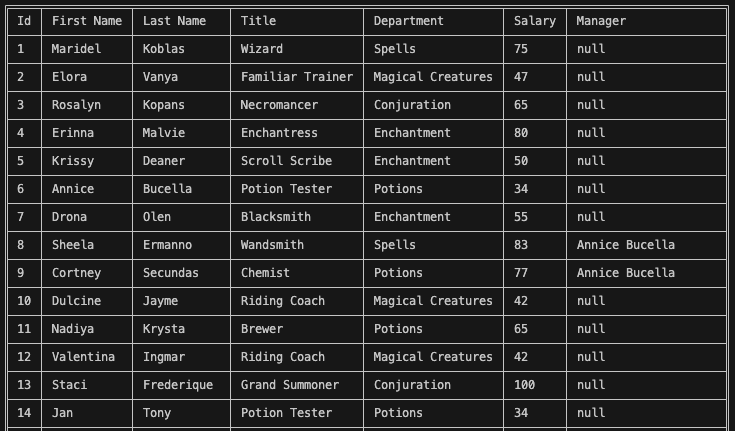
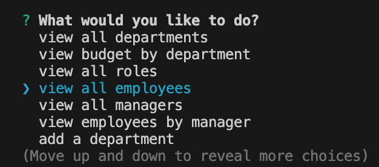

# Data Charm 🪄

## Description

[Click here to see installation instructions.](#installation)

Data Charm is a CMS (content management system) tool that helps companies handle important data, such as employees, roles, and departments.




The setup process made flexible using an `.env` file, which allows users to create a database and use their MySQL server based on their specifications.

## Installation

To install, first clone the repository:

    git clone git@github.com:jacob-medina/data-charm.git

Then, in the root directory of the project, install dependencies:

    npm install


## Setup

**This application requires a `.env` in the root directory** to use certain environment variables. You can create a template `.env` file by running:

    npm run env

The resulting `.env` template will look like below. **Enter your MySQL password into the `DB_PASSWORD` field** to be able to use your MySQL server. You can change the other fields in the template to your liking.

```
DB_NAME=charm_db
DB_HOST=localhost
DB_USER=root
DB_PASSWORD="your password here"
```

To create the `charm_db` database and seed data, run:

    npm run build


## Usage

To start Data Charm, run:

    npm start

It will output a menu like below:



You may choose the following options in the current version of Data Charm:

- View all departments
- View budget by department
- View all roles
- View all employees
- View all managers
- View employees by manager
- Add a department
- Add a role
- Add an employee
- Update an employee role
- Quit


## Credits
- `table` package (Output data as table): [table](https://www.npmjs.com/package/table)
- `db/random-name` (Random name repository): [dominictarr](https://github.com/dominictarr/random-name/tree/master)
- `dotenv` package (Create environment variables from .env): [scottmotte](https://www.npmjs.com/package/dotenv)
- [inquirer](https://www.npmjs.com/package/inquirer/v/8.2.4)
- [mysql2](https://www.npmjs.com/package/mysql2)


## License

This project is made under the [MIT License](./LICENSE).